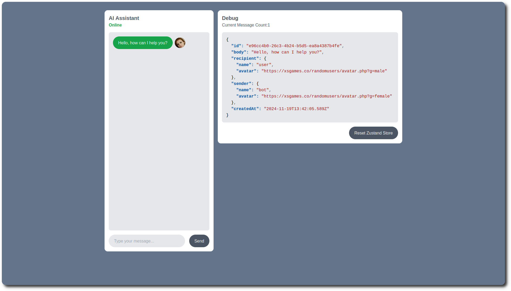
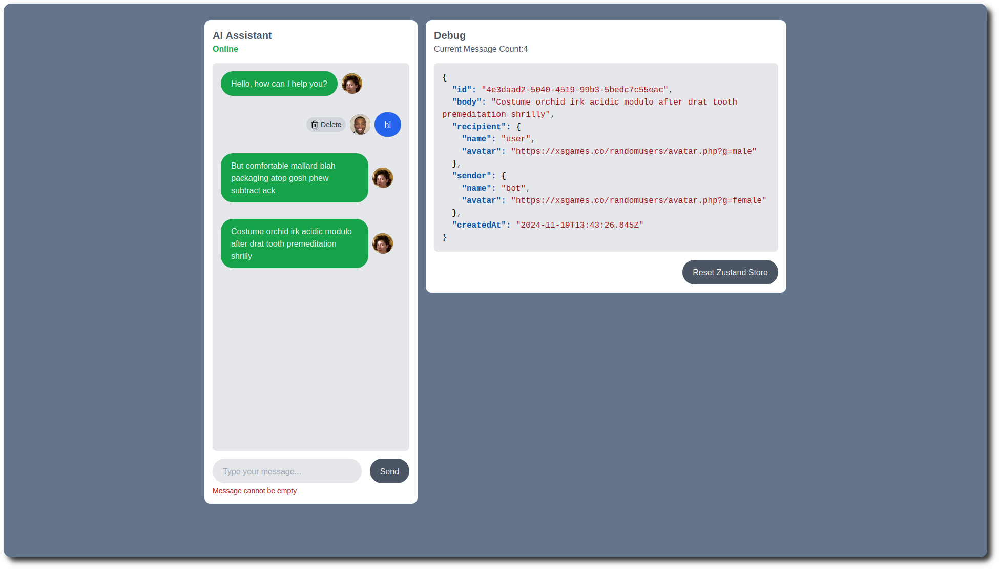

# Next.Js Zustand Zod Chat Demo

     

A chat demo I built to experiment with Zustand persistent storage.

## Features

- 🐻 Zustand persistent storage
- 🎨 Utility styling with TailwindCSS
- 💬 Interactive message bubbles with avatars

## Screenshots





## Tech Stack

- Next.Js Framework
- Zustand for persistent storage
- Zod for input validation
- TailwindCSS for utilty styling
- ESLint for clean source

## Getting Started

1. **Install dependancies**

   ```
   yarn
   ```

2. **Start the Application**

   ```
   yarn dev
   ```
